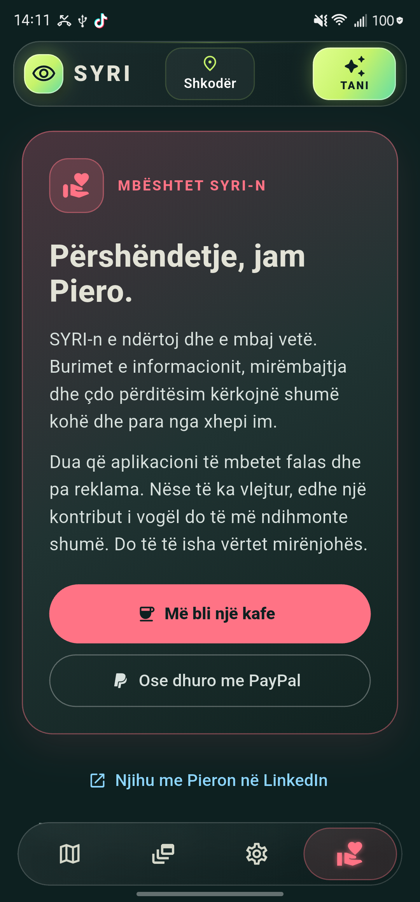

# SYRI

**Harta e informacionit publik për Shqipërinë, Kosovën, Malin e Zi dhe Maqedoninë e Veriut.**

SYRI bashkon lajme, alarme, mot, të dhëna për territorin e ujërat, transport, kamera publike dhe kanale televizive në një hartë Android. Zgjidh qytetin, prek një kategori për të shfaqur të gjitha nënkategoritë ose prek shigjetën për të zgjedhur vetëm ato që të interesojnë. Zgjedhjet ruhen në pajisje. **SYRI Tani** përmbledh motin dhe raportimet pranë qytetit, me parashikim shtatëditor. Aplikacioni mund të përdoret në shqip ose anglisht.

Të dhënat vijnë nga burime të jashtme dhe mund të jenë të vonuara ose të padisponueshme. SYRI tregon burimin dhe kohën e përditësimit kur janë të disponueshme; për vendime të rëndësishme kontrollo njoftimin origjinal. Harta dhe të dhënat e hapura më parë mund të përdoren nga cache kur je offline, por mbulimi offline nuk garantohet për çdo zonë.

## Pamje nga aplikacioni

| Harta dhe lajmet | Ngjarjet | SYRI Tani |
| --- | --- | --- |
|  |  |  |

| Cilësimet | Mbështet SYRI-n |
| --- | --- |
|  |  |

## Shkarko për Android

Shkarko APK-në më të fundit nga [Releases](https://github.com/pieroboseta/SYRI/releases). Android mund të kërkojë leje për instalim nga burime të tjera. APK-ja e publikimit është e firmosur me çelësin e projektit; nëse ke një version të vjetër provë të firmosur me çelësin debug, duhet ta çinstalosh atë përpara se të instalosh këtë version. Ruaj cilësimet e rëndësishme përpara çinstalimit.

## Çfarë përfshin

- Lajme dhe alarme me lidhje te burimi origjinal, filtra sipas vendit e qytetit dhe pamje Ngjarjesh.
- Mot, parashikim shtatëditor, cilësi ajri, UV, polen, radar shiu dhe kushte detare kur burimet kanë të dhëna.
- Tërmete, zjarre, rreziqe dhe shtresa të tjera publike në hartë.
- Avionë, pika transporti, kamera publike dhe lidhje me kanale televizive.
- Cilësime për njoftimet, shtresat e hartës, gjuhën dhe qytetet e preferuara.
- Udhëzues brenda aplikacionit dhe burime të shënuara qartë.

Mbulimi nuk është identik për çdo burim dhe çdo vend. Shih [SOURCES.md](SOURCES.md) për burimet, kufizimet dhe statusin e secilit integrim.

## Zhvillimi

Projekti është ndërtuar me Flutter. Pas instalimit të Flutter dhe Android SDK, përdor `flutter pub get` dhe `flutter run` nga rrënja e projektit. Për kontrolle përdor `flutter test` dhe `flutter analyze`.

Skedarët privatë të firmosjes (`android/key.properties` dhe `android/app/syri-upload.jks`) nuk janë pjesë e repository-t. Një kopje e re mund të ndërtojë një version debug; për APK publikimi duhet të konfigurosh çelësin tënd të firmosjes. Projekti iOS është për zhvillim të mëvonshëm në macOS/Xcode.

## Licenca

Kodi i projektit shpërndahet sipas [licencës MIT](LICENSE). Të dhënat, hartat, markat dhe përmbajtja e burimeve të jashtme mbeten nën kushtet e burimeve përkatëse; shih [SOURCES.md](SOURCES.md).
