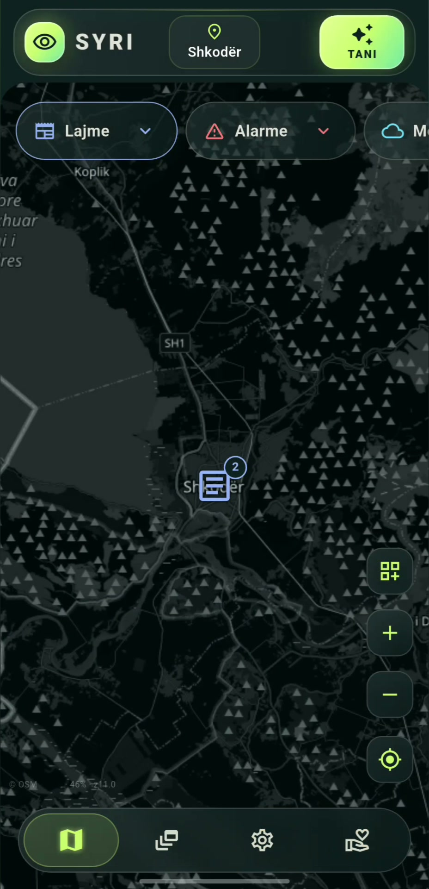
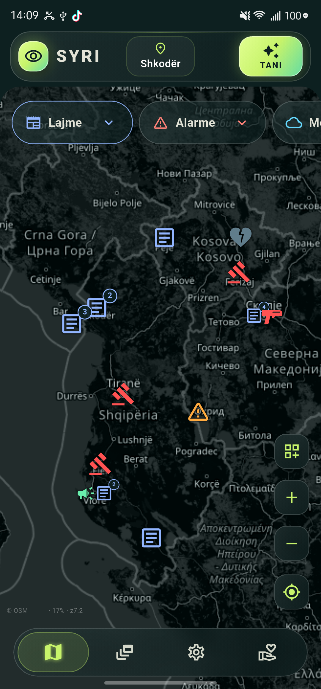
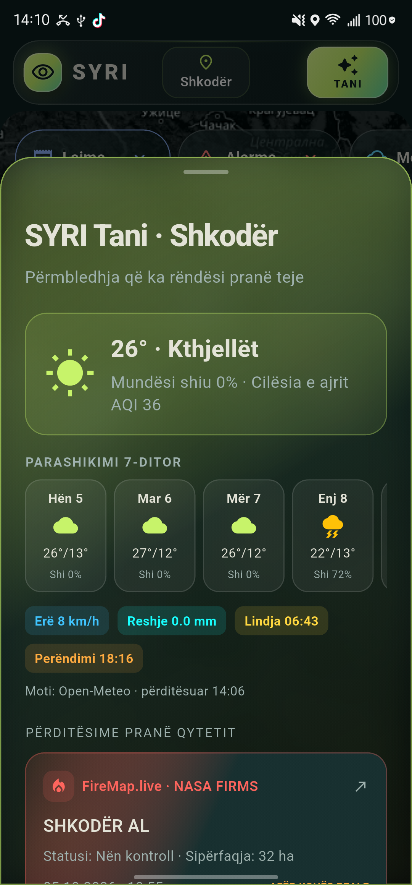
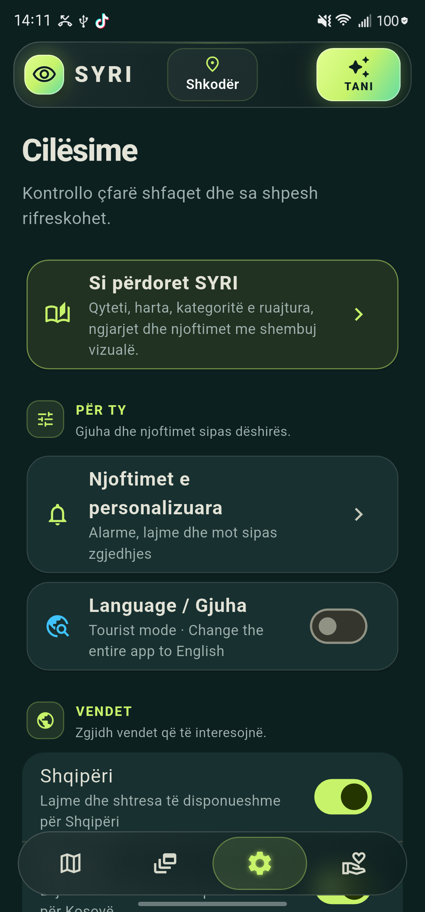

# SYRI - public information map for Albania, Kosovo, Montenegro and North Macedonia

**Informacioni publik i katër vendeve, në një hartë.** SYRI është një aplikacion Android për Shqipërinë, Kosovën, Malin e Zi dhe Maqedoninë e Veriut. Ai bashkon raportime, alarme dhe të dhëna nga burime të ndryshme, duke të lejuar të kalosh nga pamja e përgjithshme te burimi origjinal i çdo informacioni.

  
   
  <a href="https://github.com/pieroboseta/SYRI/releases/download/v0.19.37/SYRI-guide.mp4"><strong>▶ Shiko videon: si përdoret SYRI</strong></a>
   
  Videoja tregon përdorimin e aplikacionit; disa hollësi të pamjes mund të ndryshojnë në versionin më të ri.

  
   
  Versioni më i fundit · shkarkim direkt nga GitHub Releases

## ✨ Çfarë mund të bësh

| 🗺️ Në hartë | 📱 Në aplikacion |
| --- | --- |
| Shiko lajme, alarme, mot, ujëra, territor, transport, kamera dhe kanale televizive sipas shtresave që zgjedh. | Zgjidh qytetin, ruaj të preferuarat dhe merr përmbledhjen **SYRI Tani** me motin, parashikimin shtatëditor dhe raportimet pranë tij. |
| Prek ikonat për hollësi, kohën e raportimit dhe lidhjen te burimi origjinal. | Te **Ngjarjet** shiko raportimet kryesore; te **Cilësimet** rregullo gjuhën, vendet, shtresat, njoftimet dhe madhësinë e ikonave. |

Zgjedhjet e kategorive ruhen në pajisje. Harta dhe informacioni i hapur më parë mund të mbeten të disponueshëm nga cache kur je offline; kjo **nuk** do të thotë se e gjithë harta është e shkarkuar për përdorim offline. Burimet e jashtme ndryshojnë sipas vendit dhe mund të vonohen ose të mos jenë përkohësisht të disponueshme.

Te **Moti** mund të shohësh një shtresë të tejdukshme për retë, mjegullën dhe drejtimin e erës, të bazuar në parashikimet e qyteteve të vendeve të aktivizuara. Te Legjenda zgjedh orën për gjashtë orët e ardhshme dhe hap shifrat e qytetit. Te **Ujërat** shfaqet parashikimi shtatëditor i prurjes në pika modeli pranë qyteteve; nuk është matje e stacionit apo paralajmërim përmbytjeje. Te **Alarmet** aktiviteti diellor i NOAA shfaqet si gjendje globale, pa pretenduar ndikim të konfirmuar në një qytet.

## 🧭 Fillo me SYRI

1. Prek qytetin në krye të ekranit për të zgjedhur vendin tënd; mund t’i shënosh qytetet e përdorura shpesh me yll.
2. Prek emrin ose ikonën e një kategorie për të aktivizuar shtresat e saj. Prek vetëm shigjetën për të hapur nënkategoritë dhe për t’i zgjedhur një nga një.
3. Prek një ikonë në hartë për të lexuar hollësitë dhe, kur është e disponueshme, për të hapur burimin origjinal.
4. Përdor butonin e zgjedhjes së kategorive në hartë për të ruajtur shtresat që dëshiron të shfaqen edhe herën tjetër.
5. Për udhëzime të ilustruara, hap **Cilësimet → Si të përdorësh SYRI-n**.

## 🖼️ Pamje nga aplikacioni

| Harta dhe lajmet | Ngjarjet | SYRI Tani | Cilësimet |
| :---: | :---: | :---: | :---: |
|  |  |  |  |

## ⬇️ Shkarkimi dhe instalimi në Android

**[⬇ Shkarko direkt SYRI-Android.apk](https://github.com/pieroboseta/SYRI/releases/latest/download/SYRI-Android.apk)** · [Shiko versionet e publikuara](https://github.com/pieroboseta/SYRI/releases)

1. Shkarko APK-në në telefon dhe hape nga shfletuesi ose nga aplikacioni i skedarëve.
2. Nëse Android nuk lejon instalimin, hap **Cilësimet → Aplikacionet → Qasje e veçantë → Instalo aplikacione të panjohura** (*Settings → Apps → Special app access → Install unknown apps*). Zgjidh shfletuesin ose aplikacionin e skedarëve me të cilin hape APK-në dhe aktivizo **Lejo nga ky burim** (*Allow from this source*). Emrat e menuve mund të ndryshojnë sipas telefonit. Pastaj hape sërish APK-në. [Udhëzim nga Google](https://support.google.com/pixelphone/answer/7391672?hl=en).
3. Nëse ke instaluar më parë një version prove të firmosur me çelësin **debug**, Android mund të mos lejojë përditësimin me APK-në e publikimit. Në atë rast ruaj cilësimet e rëndësishme, çinstalo versionin e provës dhe instalo këtë APK.

Lejen e instalimit jepja vetëm aplikacionit nga i cili po hap APK-në. Mund ta çaktivizosh përsëri pas instalimit. Për siguri, shkarko SYRI-n vetëm nga kjo faqe zyrtare e projektit.

Për të parë nëse ka version të ri, hap **Cilësimet → Përditësimi → Rifresko**. Kur del version i ri, butoni i shkarkimit hap publikimin përkatës në GitHub. SYRI kontrollon edhe periodikisht kur ka internet dhe mund të shfaqë një njoftim në aplikacion ose një njoftim Android, nëse i ke dhënë lejen e njoftimeve. Kontrolli në sfond varet nga kufizimet e Android-it dhe nuk kryhet domosdoshmërisht në të njëjtën orë çdo ditë. Përditësimi instalohet nga APK-ja e GitHub; aplikacioni nuk e instalon vetë.

## 🌐 Burimet dhe kufizimet

SYRI shfaq informacion nga shërbime publike dhe burime të jashtme. Kur burimi dhe koha e përditësimit janë të disponueshme, aplikacioni i shënon. Për vendime të rëndësishme, veçanërisht gjatë emergjencave, kontrollo gjithmonë njoftimin origjinal. Mbulimi nuk është identik në të katër vendet për çdo shtresë. Shih [SOURCES.md](SOURCES.md) për burimet, kufizimet dhe statusin e integrimeve.

## 🛠️ Zhvillimi dhe licenca

Projekti është ndërtuar me Flutter. Pas instalimit të Flutter dhe Android SDK, përdor `flutter pub get` dhe `flutter run` nga rrënja e projektit. Kontrollet kryesore janë `flutter test` dhe `flutter analyze`.

Skedarët privatë të firmosjes (`android/key.properties` dhe `android/app/syri-upload.jks`) nuk përfshihen në repository. Një kopje e re mund të ndërtojë një version debug; për APK publikimi duhet të konfigurosh çelësin tënd të firmosjes. Projekti iOS është për zhvillim të mëvonshëm në macOS/Xcode.

Kodi shpërndahet sipas [licencës MIT](LICENSE). Të dhënat, hartat, markat dhe përmbajtja e burimeve të jashtme mbeten nën kushtet e burimeve përkatëse.
